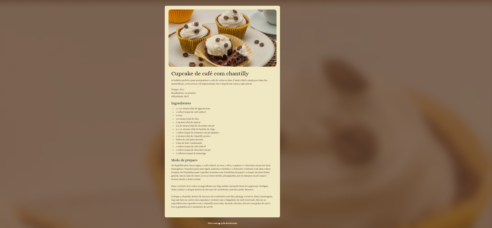

# 🌍 Projeto: Página de Receita

## 🚀 Descrição

Projeto desenvolvido durante o curso **Full Stack da Rocketseat (180h)**.  
Este repositório apresenta uma **landing page responsiva** de uma página de receita de cupcake, feita com foco em boas práticas de desenvolvimento, HTML semântico e CSS organizado.

Tem como objetivo exercitar fundamentos de estruturação, estilização e responsividade de páginas web.

## 📸 Preview



Você pode visualizar o layout original no Figma:  
[🔗 Página de Receita - Figma](https://www.figma.com/community/file/1360315130061454535/pagina-de-receita)

## 🛠️ Tecnologias Utilizadas

- HTML5
- CSS3

## 📂 Estrutura do Projeto

📁 Projeto de Receita/

    ├── Projeto Página de Receita/

    ├── bg-image.png

    │ ├── index.html

    │ ├── main-image.png

    │ ├── style.css

├── ReceitaPagina.png

└── README.md

## 🧪 Como executar o projeto

1. Clone o repositório:

```bash
git clone https://github.com/LucasValada/Projeto-de-Receita.git
cd Projeto-de-Receita
Abra o arquivo index.html no navegador:
    Clique duas vezes sobre ele OU
    Use a extensão Live Server no VSCode.
```
